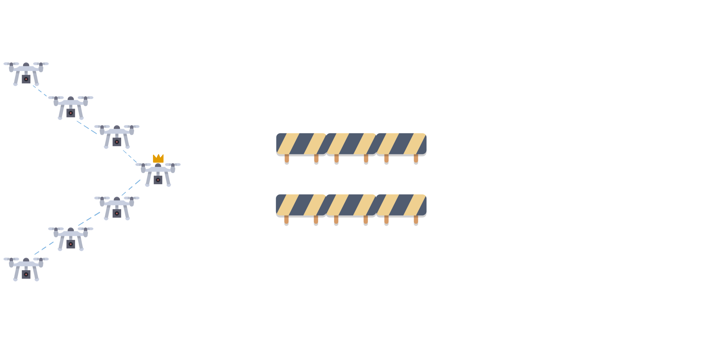
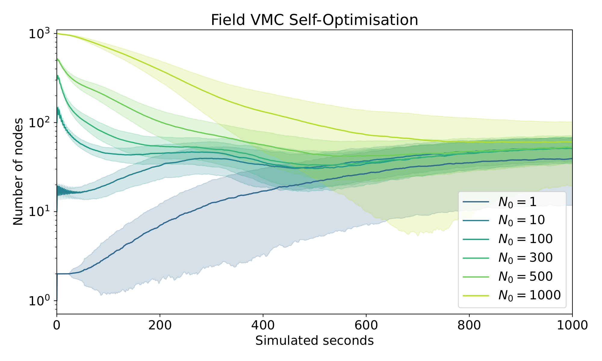
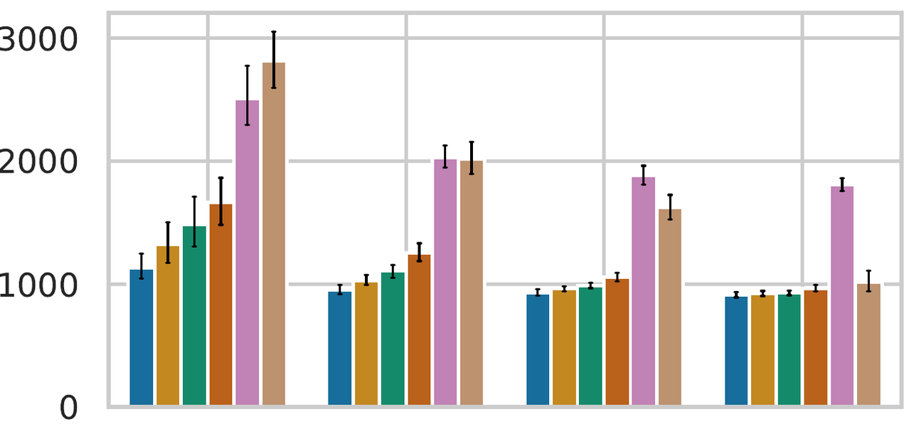
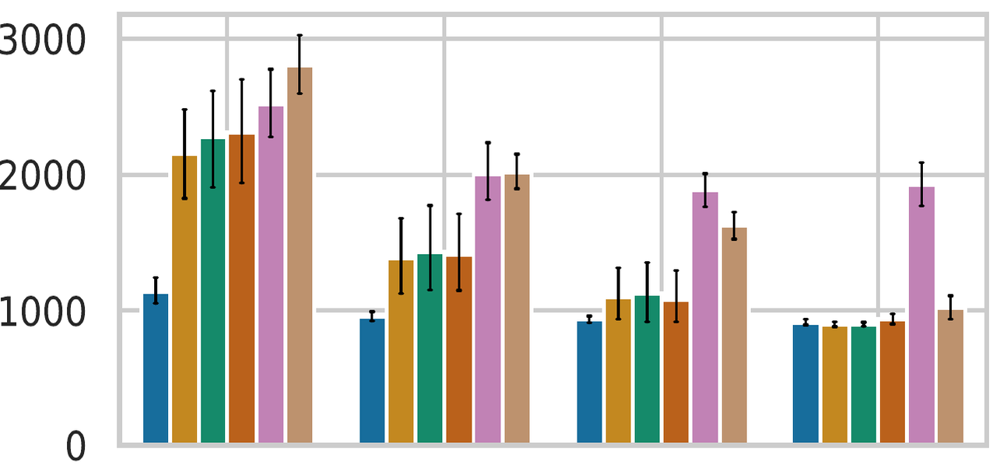
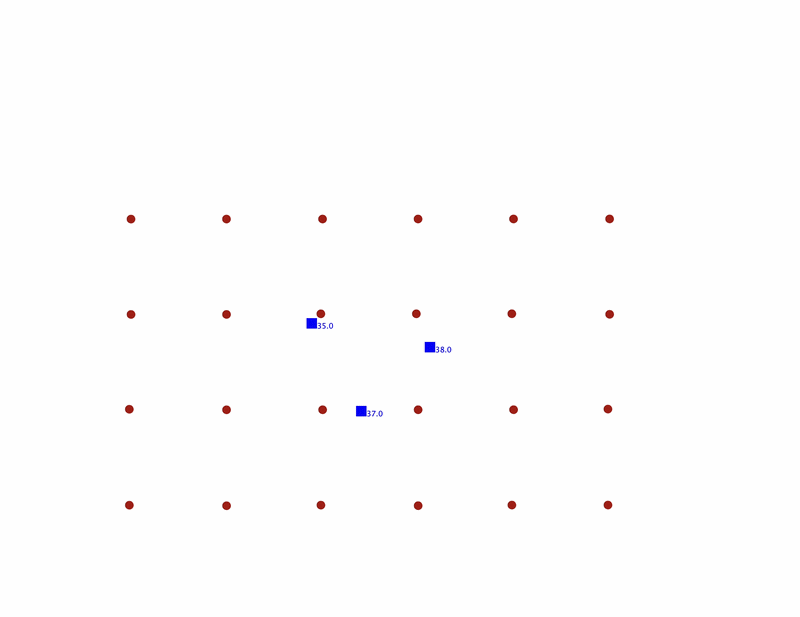
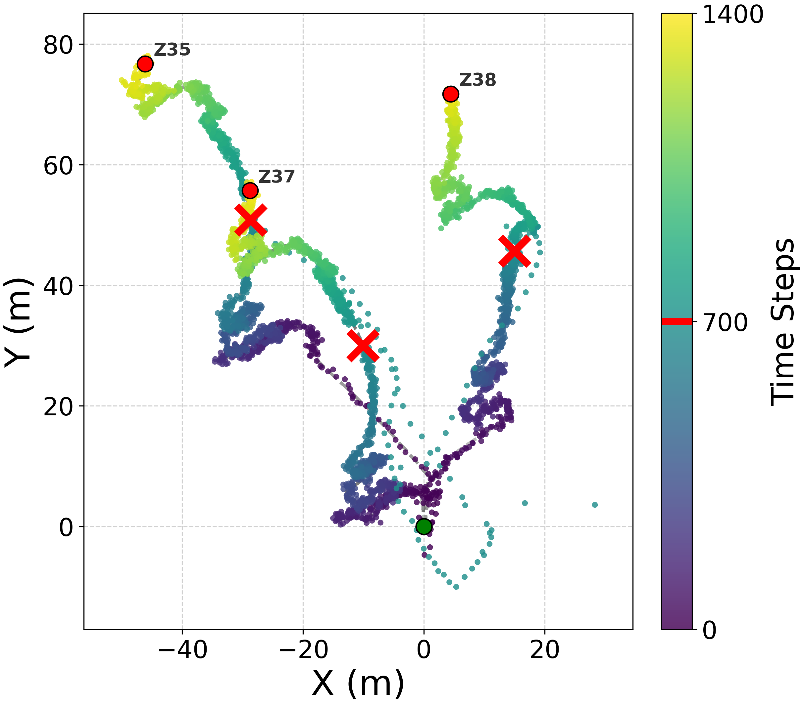
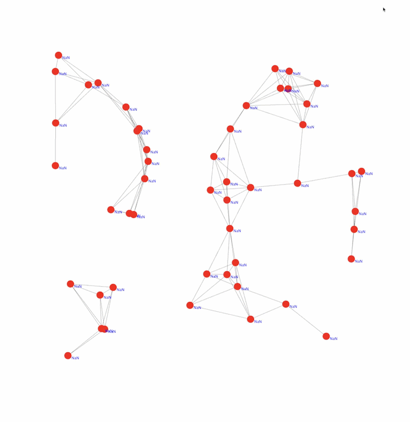
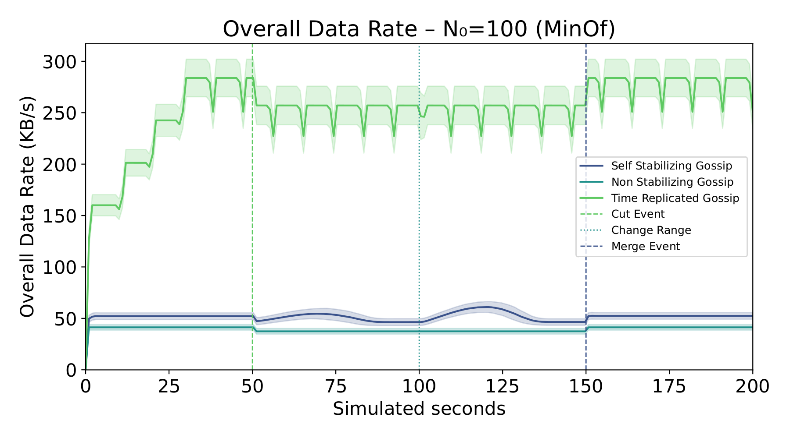
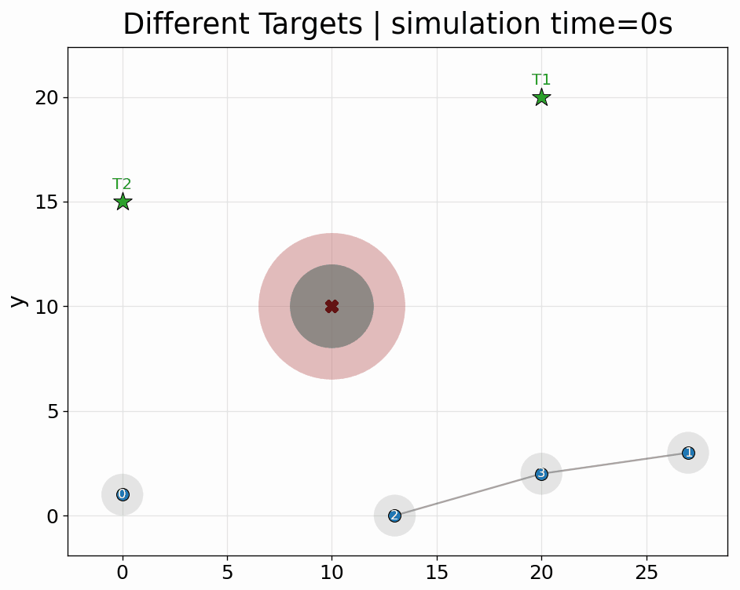
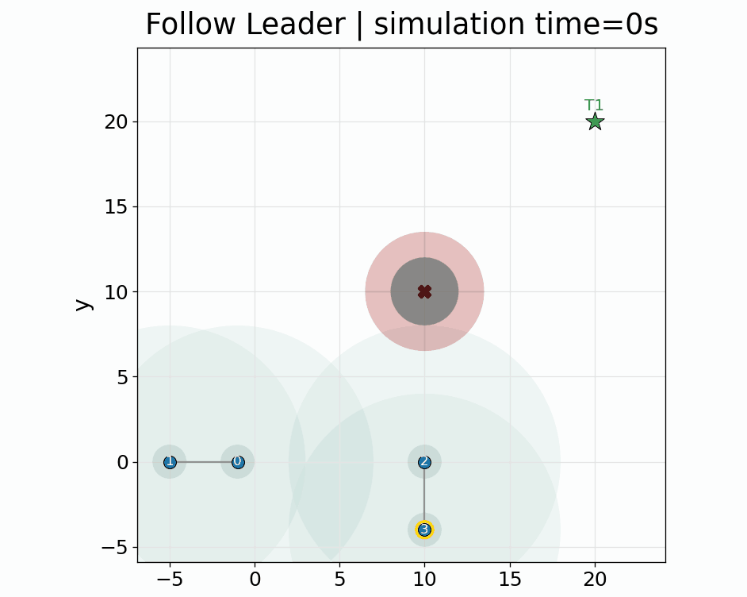

+++
title = "Advances in Collective Robotics Through Macro-Programming"
description = "UniBo PhD Second Year presentation 2026"
outputs = ["Reveal"]
+++



# Advances in Collective Robotics Through Macro-Programming

<strong>Angela Cortecchia</strong> 
Supervisor: <em>Prof. Danilo Pianini</em> Co-supervisor: <em>Prof. Mirko Viroli</em> Committee member: <em>Prof. Enrico Gallinucci</em>

<a href="mailto:angela.cortecchia@unibo.it">angela.cortecchia@unibo.it</a>

{}
**[Title — *Advances in Collective Robotics Through Macro-Programming* (0:30)]**

Good morning, and thank you for being here.

I am Angela Cortecchia, second-year PhD student under the supervision of Professor Danilo
Pianini and Professor Mirko Viroli, with Professor Enrico Gallinucci as committee member.

My doctoral research asks how macro-programming can support the engineering of collective
robotic systems. In the next fifteen minutes I will set out the problem, tell you where my
research proposal placed it, show you the five contributions I have produced so far, and
say what is left for the third year.
{}

---



The engineering problem

# A swarm keeps changing while it operates

{}
{}

A robotic collective must pursue a **system-level goal** with only local views and
**no centralized point of coordination**.

Robots are heterogeneous: they move, fail, join, and leave

Connectivity and sensing change at runtime

Unsafe transients can cause physical damage

The collective needs runtime support, not only a coordination algorithm.

{}
{}

{}
{}

{}
**[The engineering problem — *A swarm keeps changing while it operates* (1:10)]**

Think about a swarm of drones on a mission. For example, monitoring a crowded area, tracking
something that moves, holding a formation.

But in these scenarios the set of devices is usually heterogeneous, so there are devices with
different capabilities: some may fly, some may be fixed in the environment, some may be
ground-based.

However, the mission is viewed as a global goal — "cover this area" — without saying where
the devices should be.

While the mission is running there is usually no a-priori knowledge of the environment, thus
different unexpected events may occur: devices may fail or join the network, obstacles may
appear, the network may be interrupted.

We need a system that is resilient to all those events and that is able to self-organize to
reach its goal, without the need for an external intervention that continuously tells the
devices what to do, and without a centralized controller.
{}

---



Programming abstraction

# Macro-programming the collective

{}
{}

Current approach
<strong>Each robot is programmed individually</strong>
ROS is a common example. With hundreds of heterogeneous devices, the description does not scale, and failures must be handled one by one.

With **Aggregate Computing** the collective is programmed as a whole, and the same
program runs asynchronously on every device, which in each round:

1. **senses** its own sensors and the latest messages from its neighbors;
2. **evaluates** the same aggregate program on that context;
3. **acts** on the result, and shares it with its neighbors.

Local executions compose into a global behavior.

{}
{}

Computational fields

A <strong>computational field</strong> is a distributed data structure that maps every device of the network to a local value.

Behavior is built by <strong>composing operators over fields</strong>: spread a value, aggregate it, restrict it to a region.

{}
{}

{}
**[Programming abstraction — *Macro-programming the collective* (1:30)]**

To program such systems, we need an abstraction that expresses what the collective has to
achieve, rather than what each device has to do.

Classical approaches, such as ROS, define what each device should do individually. With a few
devices this works quite well. With hundreds of heterogeneous devices, what does not scale is
the description: the number of interactions we have to specify by hand grows with the number
of devices and with their roles. And adaptation is not part of the model — failures have to be
handled explicitly, one by one.

There are macro-programming approaches that investigate the opposite point of view: the
reasoning is global. A paradigm that does this is Aggregate Computing, where we write one
program for the collective as a whole. The same program is executed asynchronously on every
device, without a centralized controller.

It is based on an abstraction called the **computational field**: a distributed data structure
that maps each device of the network to its own value — for example, the distance to a target,
or the identity of the current leader. We operate on those fields with specific operators, and
those operators can be composed into more complex behaviors.

Here each device independently senses local information, both from the environment and from
the neighboring devices; then it evaluates its aggregate program on that information; then it
acts on the result, and shares the latest information with its neighbors.

And the consequence is the line at the bottom of the slide: local executions compose into a
global behavior.
{}

---



Research gap

# What is missing?

<h3>Classic Aggregate Computing applications</h3>

One collective program, deployed once

<ul>
<li>A single behavior runs on each device</li>
<li>No preemption, no lifecycle management</li>
<li>Self-stabilization guarantees recovery <em>eventually</em></li>
</ul>

<h3>What a swarm mission needs</h3>

Several behaviors, changing while the swarm flies

<ul>
<li>Concurrent applications on the same devices</li>
<li>An authorized operator that can stop or switch them</li>
<li>Constraints that hold <em>during</em> the transient</li>
</ul>

The runtime must support dynamic, safe, and authorized changes to the collective behavior.

{}
**[Research gap — *What is missing?* (1:30)]**

Classic Aggregate Computing applications run **one** collective program, deployed once: a
single behavior on each device, no preemption, no lifecycle management. And self-stabilization
guarantees recovery *eventually* — it says nothing about what happens in the meantime, which
for robots is where the collisions are.

Come back to that swarm. Halfway through the mission, the operator needs part of it to stop
covering and start doing something else. Now. Only over that sector. And only because it is
the operator asking, and not somebody else.

Today there is no way to do this. The behavior of the collective is fixed when we deploy it,
so changing it means putting a new program on every device — in a real scenario, landing the
swarm, updating it, and flying the mission again from the start. What we want is to make that
switch **at runtime**, while the collective keeps operating.

Every word in that request is an operating-system word: stop, start, only there, only them.
Suspending something that is running so that something else can take the devices is
*preemption*; deciding who may ask for it is *permissions*. Which is, almost verbatim, the
motivation I wrote in my research proposal two years ago.
{}

---



PhD research vision

# From Building Blocks to a Collective Robotic Operating System

Reusable set of mechanisms to manage collective behavior, towards an operating system-oriented architecture.

Resource management
Resources routed where they are needed, and re-routed as the demand moves
investigated

Monitoring
Collective state estimated from distributed, unreliable observations
investigated

Adaptation
Tasks redistributed at runtime when a device is lost
investigated

Consensus
Shared state converges to the best value, and survives transient faults
investigated

Safety
Physical constraints enforced while the collective is still moving
investigated

Preemption &amp; lifecycle
Start, stop and switch collective processes without redeploying
open

Permissions
Who is authorized to change the behavior of the collective
open

How can reusable runtime mechanisms keep collective behavior manageable while robots, goals, and networks change?

{}
So, the vision. A **Collective Robotic Operating System** is a layer between the collective
programs and the devices that run them. Its job is the job of any operating system: manage the
resources, keep track of the state of the machine, decide what runs and who may change it.
Except that the machine here is not one robot — it is the collective, spread over space.

So the way to ask what such a system must provide is to take each capability an operating
system gives a single machine, and ask what it becomes for a collective.

Managing resources becomes routing them to the areas that need them most at a given moment,
and re-routing them when that changes. Knowing the state
of the machine becomes estimating it from distributed, unreliable observations. Recovering
from a failed component becomes redistributing tasks when a device is lost. Keeping memory
consistent becomes agreeing on a value that survives faults. Protecting the hardware becomes
enforcing physical constraints while the collective is still moving. And running processes
becomes starting, stopping and switching collective behaviors — with someone authorized to do
it.

That is this table. The first five already have a mechanism, and they are the five
contributions I am about to show you. The last two do not, and they are the third year.

So the research question is: how can reusable runtime mechanisms keep collective behavior
manageable while robots, goals, and networks change?
{}

---



Main thesis contributions 1/5

# FieldVMC [1]

Resource managementSupporting self-organizing morphogenesis of artificial structures

<figure class="demo">

<figcaption>
Structures grow, branch and repair from a local flow of resources, with no global blueprint.
Resources are routed towards the most successful area of the network.
</figcaption>
</figure>

<ul class="finding-list">
<li><strong>Asynchronous and decentralized</strong>, over arbitrary network topologies</li>
<li>Structures <strong>merge, split and reorganize</strong> as conditions change</li>
<li>Faster convergence than VMC, with new self-organizing behaviors: <em>self-integration</em>, <em>self-division</em>, <em>self-optimization</em></li>
</ul>

<figure class="evidence">

<figcaption>Widely different initial configurations converge towards similar resource-efficient structures.</figcaption>
</figure>

{}
[1] A. Cortecchia, G. Ciatto, R. Casadei, and D. Pianini, *"FieldVMC: an asynchronous model and platform for self-organising morphogenesis of artificial structures"*. Complex Intell. Syst. 12(2) (2026)
{}

{}
The first mechanism is about growing structure where the collective needs it.

FieldVMC is an asynchronous, fully decentralized reformulation of the Vascular Morphogenesis
Controller. What you see on the left is a structure that grows, branches and repairs itself
purely from a local flow of resources — there is no global blueprint anywhere. Resources are
routed towards whichever area of the network is being most successful, so the structure
concentrates where it pays off.

Because it is asynchronous and field-based, it works over arbitrary network topologies, and
structures can merge, split and reorganize as conditions change — behaviors that the
original centralized formulation could not express.

The plot on the right is the one I like most. Six populations, from a single node up to a
thousand, all converge towards structures of comparable size: the model finds a
resource-efficient configuration regardless of where it starts. We also observed genuinely
new behaviors — self-integration, self-division, and this self-optimization — and
convergence faster than the original VMC.

This work is published in Complex and Intelligent Systems.
{}

---



Main thesis contributions 2/5

# Runtime replanning [2]

AdaptationA field-based approach for runtime replanning in swarm robotics missions

<figure class="demo">

<figcaption>
A mission is assigned to the swarm; when a robot is lost, its tasks are redistributed among the survivors.
The plan is repaired by the collective while it operates, without re-running a global planner.
</figcaption>
</figure>

<ul class="finding-list">
<li>Two field-based strategies: fully distributed <strong>gossip</strong> and dynamic <strong>leader election</strong></li>
<li>With sufficient connectivity, both beat late-stage replanning and approach the centralized <em>Oracle</em></li>
<li>Gossip is more resilient to frequent failures; leader-based coordination lowers replanning overhead</li>
</ul>

<figure class="evidence plots">

Gossip

Leader election

<ul class="plot-key">
<li>Oracle</li>
<li>R&nbsp;=&nbsp;&infin;</li>
<li>R&nbsp;=&nbsp;100</li>
<li>R&nbsp;=&nbsp;50</li>
<li>R&nbsp;=&nbsp;20</li>
<li>Baseline</li>
</ul>
<figcaption>Mission stable time (lower is better) against mean time between failures; 20 robots, 4 tasks each. <em>R</em> is the radio range in meters.</figcaption>
</figure>

{}
[2] G. Aguzzi, M. Baiardi, A. Cortecchia, B. Miloradovic, A. Papadopoulos, D. Pianini, and M. Viroli, *"A Field-Based Approach for Runtime Replanning in Swarm Robotics Missions"*. (ACSOS 2025)
{}

{}
The second mechanism is about what happens when you lose a robot mid-mission.

A mission is assigned to the swarm as a set of tasks. A robot fails. Classically you would
call a global planner again — which means a central point, and a stop. Here the plan is
repaired by the collective itself, while it keeps operating: the tasks of the lost robot are
redistributed among the survivors.

We formulated two field-based strategies for this: fully distributed gossip, and dynamic
leader election. The two panels compare them against a centralized Oracle and against a
late-stage baseline, for different communication ranges.

Two findings. First, with sufficient connectivity both strategies beat late replanning and
get close to the Oracle — which is the interesting part, because the Oracle is not
implementable. Second, the two are not interchangeable: gossip is more resilient when
failures are frequent, while leader-based coordination costs less in replanning overhead.
That trade-off is a design knob, not a defect.

This was presented at ACSOS 2025, and received the best student paper award.
{}

---



Main thesis contributions 3/5

# Field-based distributed particle filtering [3, 4]

MonitoringTracking multiple targets from noisy, distributed observations

<figure class="demo">

<figcaption>
Several targets tracked from noisy observations, with observers that move and lose connectivity.
Filtering is decoupled from coordination: where fusion happens and how information propagates become design choices, reconfigurable at runtime.
</figcaption>
</figure>

<ul class="finding-list">
<li>Local cooperation <strong>improves tracking accuracy</strong></li>
<li>Leader-based fusion <strong>recovers after failures</strong>, with leaders re-elected at runtime</li>
<li>Mobile observers <strong>adapt their spatial configuration</strong> while tracking</li>
</ul>

<figure class="evidence tall">

<ul class="plot-key">
<li>Real trajectory</li>
<li>Estimated</li>
<li>Start</li>
<li>End</li>
<li>&times;Fusion-center failure</li>
</ul>
<figcaption>Three targets tracked across repeated fusion-center failures.</figcaption>
</figure>

{}
[3] A. Cortecchia, D. Domini, G. Ciatto, R. Casadei, D. Pianini and M. Viroli, *"Flexible Distributed Particle Filtering for the Internet of Things via Aggregate Computing,"* (DCOSS-IoT 2026)

[4] A. Cortecchia, D. Domini, G. Ciatto, R. Casadei, and M. Viroli, *"Multi-Target Tracking via Field-Based Distributed Particle Filtering"* (ACSOS 2026)
{}

{}
The third mechanism answers the proposal's "distributed sensors and actuators": making many
unreliable observers behave as one collective sensor.

Distributed particle filtering is the standard tool for state estimation from noisy,
non-Gaussian observations. The problem is that existing algorithms bake their architecture
into the filter: whether there is a fusion center, who the leader is, how information
propagates — all hard-wired.

What I did is express sensing, information dissemination, role assignment and the particles
themselves as computational fields. That decouples the filtering logic from the coordination
logic. Where fusion happens, and how information travels, become design choices you can vary
without redesigning the estimator — and, more importantly, choices the system can change at
runtime.

On the right, three targets tracked across repeated failures of the fusion center: the
collective re-elects a leader and the estimate recovers. We also showed that local
cooperation improves accuracy, and that mobile observers can adapt their spatial
configuration while tracking.

Two papers: DCOSS-IoT 2026 for the formulation, ACSOS 2026 for multi-target tracking with
mobile observers — which received the best companion artifact award.
{}

---



Main thesis contributions 4/5

# Self-stabilizing min-max gossip [5]

ConsensusA gossip algorithm that converges to the best value in the network from any state

<figure class="demo">

<figcaption>
The best available value propagates through the network, and the collective reconverges after arbitrary transient states.
Each message carries the path of nodes that acknowledged it: that is what lets stale contributions be pruned, which classical min&ndash;max gossip cannot do.
</figcaption>
</figure>

<ul class="finding-list">
<li><strong>Fully decentralized</strong>: no leader, global reset, timestamps or coordinated epochs</li>
<li>Recovers after <strong>topology changes and transient faults</strong></li>
<li><strong>Lower communication overhead</strong> than time-replicated gossip</li>
</ul>

<figure class="evidence">

<figcaption>Data rate across cut, range-change and merge events: self-stabilization costs a fraction of time replication.</figcaption>
</figure>

{}
[5] A. Cortecchia, D. Pianini, and M. Viroli, *"Self-Stabilizing Min-Max Gossip for Aggregate Computing"* (COORDINATION 2026)
{}

{}
The fourth mechanism is the one closest to a foundational building block. It is about
keeping distributed state consistent — how the *devices* of the network agree on a value.

Min–max gossip is how a network agrees on a "best" value — the closest target, the highest
battery, the elected leader. But classical min–max consensus is monotonic and *not*
self-stabilizing: once a value has been merged into the aggregate it can never be retracted.
So after a transient fault, or a topology change, a stale value keeps circulating forever.

The idea is to make each message carry not just the value but the *path* of nodes that
acknowledged it. That path is what lets the algorithm detect loops and prune obsolete
contributions — which is precisely what the classical formulation cannot do. The result is
fully decentralized: no leader, no global reset, no timestamps, no coordinated epochs.

We proved self-stabilization formally, and implemented it as a reusable library function in
Collektive. The plot compares communication cost against time-replicated gossip, which is
the usual way of buying self-stabilization: across cut, range-change and merge events, our
approach costs a fraction of it.

Published at COORDINATION 2026.
{}

---



Main thesis contributions 5/5

# CAROL: Coordinated Aggregate Robotics with Online control Lyapunov and barrier functions [6]

SafetyA safety filter between collective strategy and actuation

<strong>Aggregate program</strong> &middot; computes the wanted behavior

<strong>Safety filter</strong> &middot; refines it into a feasible command

<figure class="filter-diagram">

<figcaption><strong>Different goals while collaborating</strong></figcaption>
</figure>
<figure class="filter-demo">

<figcaption><strong>One shared goal: follow the leader</strong></figcaption>
</figure>

{}
[6] A. Cortecchia, A. Papadopoulos, and D. Pianini *"Toward Safe Aggregate Computing: A Distributed Control-Theoretic Safety Filter for Robot Swarms"* (ACSOS-C 2026)
{}

{}
The last contribution is the one that came out of my research period abroad, at the
Mälardalen University Automation Research Center, with Professor Alessandro Papadopoulos.

The question there was the one I raised at the beginning: self-stabilization guarantees that
the collective converges *eventually*, but robots are physical. During the transient they can
collide, hit an obstacle, or lose connectivity — and "eventually correct" is no comfort.

CAROL puts a safety filter between the collective strategy and the actuators. The aggregate
program computes the behavior we *want*; the filter refines it into a command that is
actually feasible, using Control Lyapunov Functions for convergence and Control Barrier
Functions for the constraints — obstacle avoidance, inter-robot collision avoidance,
connectivity preservation. The collective-level requirement is translated into per-robot
constraints and enforced in a distributed way.

The two scenarios show it working both when robots pursue different goals while
collaborating, and when they share one goal and follow a leader. Implemented in Collektive,
evaluated in Alchemist, and published in the ACSOS 2026 companion proceedings.
{}

---



[//]: # (
What is still missing
)

# Open challenges

A <strong>process</strong> here is a <em>distributed collective process</em>: one collective task carried out by a group of devices whose membership evolves in space and time &mdash; not a program running on one robot.

<h3>Preemption &amp; lifecycle</h3>

Change what the collective runs, without redeploying it

<ul>
<li><strong>Start, stop and switch</strong> collective behaviors while the swarm operates</li>
<li>Run <strong>several collective programs concurrently</strong> on the same devices</li>
<li>Today a program's lifecycle is <em>tied to the lifecycle of the devices</em></li>
<li>Aggregate processes are a first step: how a process <strong>expands and contracts in space</strong> is still open</li>
</ul>

<h3>Users &amp; permissions</h3>

Decide who may change the collective, and where

<ul>
<li>Only <strong>authorized operators</strong> can alter the behavior of the swarm</li>
<li>Processes <strong>confined to a geographic area</strong>, while the devices keep moving through it</li>
<li><strong>No notion of user, group or authority</strong> exists: who may start, join or stop a process is undefined</li>
</ul>

Mission-critical swarms need a lifecycle and an authority model, not only a coordination algorithm.

{}
Which brings me back to the two rows of the map that are still empty. One clarification
first, because the word is overloaded: a *process* here is a distributed collective process —
one collective task carried out by a group of devices whose membership evolves in space and
time. Not a program running on one robot.

**Preemption and lifecycle.** Let me be precise about what is already solved. Distributed
collective processes do spread, shrink and overlap on the same devices; a device can take
part in several of them at once; membership is re-evaluated every round. What is missing is
control from *outside*: today a process ends because its own members opt out, and there is no
authority that can suspend, resume or terminate it — signals and interrupts, in
operating-system terms. The set of behaviors the swarm can run is also still fixed at
deployment: adding a new one means redeploying. And when two processes have to exchange
information, that is hand-coded for the specific application, with no general mechanism.

**Users and permissions.** If someone can change what the swarm is doing, we need to say who
is authorized, and where — processes confined to a geographic area while the devices keep
moving through it. Aggregate computing has no notion of user, group or authority at all: who
may start, join or stop a process is simply undefined.

The point I want to leave here: a mission-critical swarm needs a lifecycle and an authority
model, not only a coordination algorithm.
{}

---



Research in progress

# Current investigations

01
<strong class="work-name">CAROL</strong>

Formation control, flocking, and coverage with the safety guarantees provided by the filter.

02
<strong class="work-name">FieldVMC</strong>

Signed Distance Fields to represent letter-shaped formations and support safe movement.

03
<strong class="work-name">Field-Based DPF</strong>

Heterogeneous sensors and actuators in more demanding scenarios, with support for additional filtering algorithms.

04
<strong class="work-name">Path replanning</strong>

FieldVMC as a mechanism for runtime path replanning.

05
<strong class="work-name">Self-Stabilizing Gossip</strong>

Weighted averages and medians, with loop detection extended to algorithms such as gradients.

{}
Work in progress, briefly.

On **CAROL**, I am extending the safety filter to formation control, flocking and coverage,
so that the guarantees hold for the collective behaviors we actually deploy.

On **FieldVMC**, I am using Signed Distance Fields to represent letter-shaped formations and
to support safe movement into them — which is also the bridge towards using FieldVMC as a
mechanism for runtime **path replanning**.

On **field-based DPF**, the direction is heterogeneous sensors and actuators in more
demanding scenarios, and support for additional filtering algorithms.

And on **self-stabilizing gossip**, extending beyond min and max to weighted averages and
medians, and reusing the loop-detection idea for other algorithms such as gradients.
{}

---



[//]: # (
Next steps
)

# Future work

<ul class="closing-list">
<li>Add the two missing building blocks: <strong>preemption and lifecycle</strong>, and <strong>permissions</strong> over collective behavior;</li>
<li>Integrate the mechanisms into a <strong>CROS prototype</strong> in Collektive.</li>
</ul>

Make the swarm programmable as one system, while keeping its adaptation explicit and safe.

{}

<a href="https://angelacorte.github.io/angelacorte/">Personal portfolio</a>

{}
For the third year, two things.

First, close the map: add the two missing building blocks — preemption and lifecycle, and
permissions over collective behavior. These are the concerns the proposal listed as signals,
interrupts, and users and permissions, and they are what turns a set of mechanisms into a
system rather than a library.

Second, integrate all of them into a CROS prototype in Collektive, so that the contributions
stop being five separate papers and become one coherent layer that somebody else can build on.

The goal, in one line: make the swarm programmable as one system, while keeping its
adaptation explicit and safe.
{}

---



Scientific activities

# Service, teaching, and community

Academic service

<ul class="activity-list">
<li><strong>Publicity Chair</strong>ACSOS 2026</li>
<li><strong>Reviewer</strong>Complex &amp; Intelligent Systems · Q1 · 2026</li>
<li><strong>Artifact Evaluation Committee</strong>Formalize 2026</li>
</ul>

Teaching

Sep 2025 – present
<strong>Programmazione ad Oggetti</strong>

Jan – Sep 2025
<strong>Architetture degli Elaboratori</strong>

<strong>7</strong>
scientific events attended

Conferences

<ul class="event-list">
<li><strong>ACSOS 2026</strong>Cesena, Italy</li>
<li><strong>DCOSS-IoT 2026</strong>Reykjavík, Iceland</li>
<li><strong>WOA 2026</strong>Salerno, Italy</li>
<li><strong>COORDINATION 2026</strong>Urbino, Italy</li>
</ul>

Summer schools

<ul class="event-list compact">
<li><strong>BISS 2025</strong>Bertinoro, Italy</li>
<li><strong>SIESTA 2025</strong>Lugano, Switzerland</li>
<li><strong>SPACERAISE 2025</strong>L'Aquila, Italy</li>
</ul>

{}
Very quickly, the rest of the activity.

On academic service: I have been Publicity Chair for ACSOS 2026, I reviewed for Complex and
Intelligent Systems, and I served on the Artifact Evaluation Committee of Formalize 2026.

On teaching: sixty hours as tutor for Object Oriented Programming this academic year, and
Architetture degli Elaboratori before that.

And I attended seven scientific events: four conferences — ACSOS, DCOSS-IoT, WOA and
COORDINATION — and three summer schools, in Bertinoro, Lugano and L'Aquila. Plus the
four-month research period at Mälardalen University that produced the safety filter.
{}

---



Research output

# Publications

- G. Aguzzi, M. Baiardi, **A. Cortecchia**, B. Miloradovic, A. Papadopoulos, D. Pianini, and M. Viroli, *"A Field-Based Approach for Runtime Replanning in Swarm Robotics Missions"*. (ACSOS 2025) <strong class="publication-award">BEST STUDENT PAPER AWARD</strong> DOI: [10.1109/ACSOS66086.2025.00017](https://doi.org/10.1109/ACSOS66086.2025.00017)
- G. Aguzzi, L. Bacchini, M. Baiardi, R. Casadei, **A. Cortecchia**, D. Domini, N. Farabegoli, D. Pianini, M. Viroli, *"A Demonstrator for Self-organizing Robot Teams"* (COORDINATION 2025) DOI: [10.1007/978-3-031-95589-1_12](https://doi.org/10.1007/978-3-031-95589-1_12)
- M. Andruccioli, **A. Cortecchia**, D. Domini, N. Farabegoli, G. Delnevo, D. Pianini, R. Venanzi, M. Viroli, *"HarmoniKt: a Unifying Middleware for Heterogeneous Robot Fleets"* (CCNC 2026) DOI: [10.1109/CCNC65079.2026.11366553](https://doi.org/10.1109/CCNC65079.2026.11366553)
- **A. Cortecchia**, G. Ciatto, R. Casadei, and D. Pianini, *"FieldVMC: an asynchronous model and platform for self-organising morphogenesis of artificial structures"*. Complex Intell. Syst. (Q1) (2026) DOI: [10.1007/s40747-025-02141-y](https://doi.org/10.1007/s40747-025-02141-y)
- **A. Cortecchia**, D. Domini, G. Ciatto, R. Casadei, D. Pianini and M. Viroli, *"Flexible Distributed Particle Filtering for the Internet of Things via Aggregate Computing,"* (DCOSS-IoT 2026) DOI: [10.48550/arXiv.2606.18483](https://doi.org/10.48550/arXiv.2606.18483)
- **A. Cortecchia**, D. Domini, G. Ciatto, R. Casadei, and M. Viroli, *"Multi-Target Tracking via Field-Based Distributed Particle Filtering"* (ACSOS 2026) <strong class="publication-award">BEST COMPANION ARTIFACT AWARD</strong> DOI: TBD
- **A. Cortecchia**, A. Papadopoulos, and D. Pianini *"Toward Safe Aggregate Computing: A Distributed Control-Theoretic Safety Filter for Robot Swarms"* (ACSOS-C 2026) DOI: TBD
- **A. Cortecchia**, *"Towards Collective Robotic Operating Systems through Aggregate Computing"* (ACSOS-C 2026) DOI: TBD
- **A. Cortecchia**, D. Pianini, and M. Viroli, *"Self-Stabilizing Min-Max Gossip for Aggregate Computing"* (COORDINATION 2026) DOI: [10.1007/978-3-032-28358-0_5](https://doi.org/10.1007/978-3-032-28358-0_5)
- F. Gurioli, M. Baiardi, **A. Cortecchia**, D. Pianini, *"High-Fidelity Simulation of Aggregate Computing Systems with Collektivity"* (COORDINATION 2026) DOI: [10.1007/978-3-032-28358-0_13](https://doi.org/10.1007/978-3-032-28358-0_13)
- N. Farabegoli, G. Aguzzi, M. Baiardi, **A. Cortecchia**, D. Domini, D. Pianini, M. Viroli. *"Project Emerge: A demonstrator for self-organizing robot teams"*, Science of Computer Programming (Q3) (2027) DOI: [10.1016/j.scico.2026.103559](https://doi.org/10.1016/j.scico.2026.103559)

{}
And this is the output so far: eleven papers, six as first author, including two journal
papers — one Q1 — a best student paper award at ACSOS 2025 and a best companion artifact
award at ACSOS 2026.
{}
